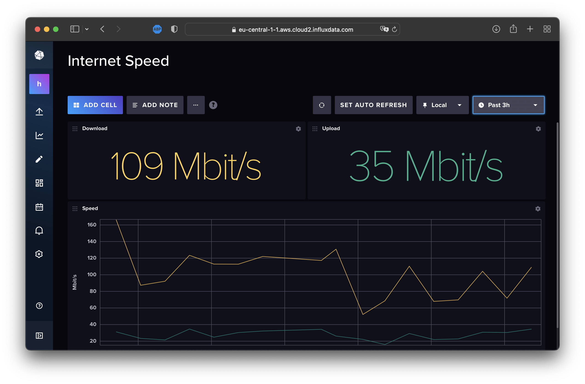

# telegraf-internet-speed-monitor

Home internet speed monitor which pushes data to cloud InfluxDB



## Description
Telegraf service is running in docker container, measures internet speed via embedded plugin and pushes results to cloud InfluxDB. This way you can see if your home internet connection is up and monitor it's speed over time.
Please note official Telegraf docker image is ARM compatible thus can be used for Raspberry PI

## How to Configure
1. Goto https://www.influxdata.com and signup with free account
2. Goto `Load Data` > `Sources` and search for `internet speed`
3. Select found Telegraf plugin
4. Click on `Use this plugin` > `Create new configuration`
5. Provide a name and create new bundle for its data
6. Provide config description and click on `Save and test`
7. Create new `.env` file in project root and copy there your `INFLUX_TOKEN` so the content of the file should be like
```
INFLUX_TOKEN=XZP...Xe
```
8. Download the file via link from second configuration: `telegraf --config https://eu-central-1-1.aws.cloud2.influxdata.com/api/v2/telegrafs/09...0`
9. Rename dowloaded file to `telegraf.conf` and copy it to project root folder
10. Modify `telegraf.conf` if needed
11. The final folder structure should be as following:
```
.
├── README.md
├── docker-compose.yml
└── telegraf.conf
```
12. Start Telegraf with following command
```
docker compose up
```
13. Create dashboard with your data and enjoy!
14. More details can be found here: https://www.youtube.com/watch?v=7WSiE5zKH1g
